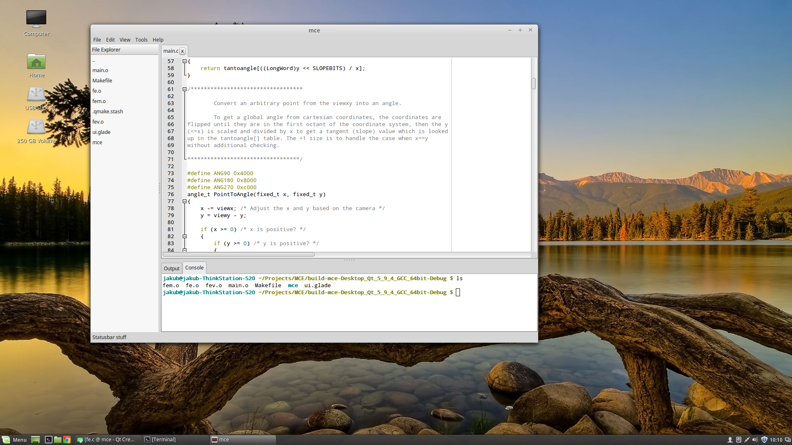

# Mint Code Editor

A simple code editor.


## Getting Started

### Prerequisites

gtk+ 2.24
GtkScintilla

### Installing

```
make
make install
```

## License

This project is licensed under the GNU GPL License - see the [LICENSE.md](LICENSE.md) file for details

